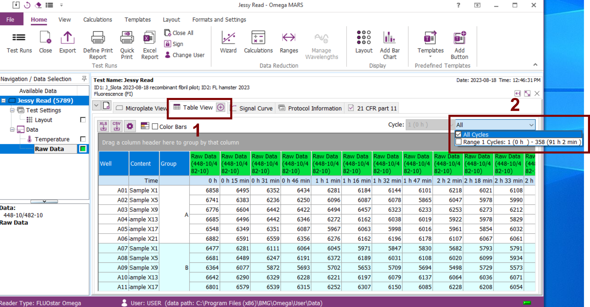
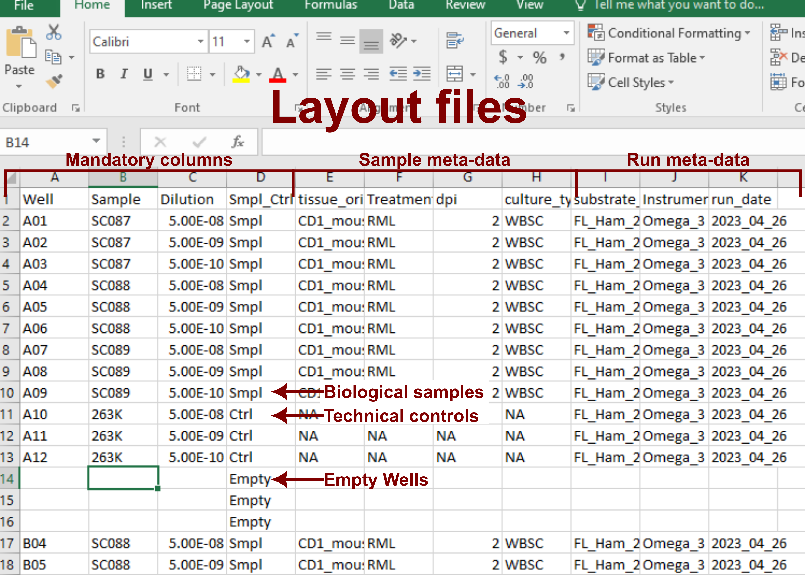
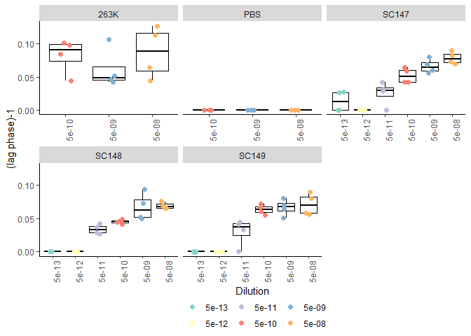

rtquicR package usage
================
Jessy Slota
2023-10-19

- [Introduction](#introduction)
  - [Usage](#usage)
- [Part I: setting up the rtquicR
  package](#part-i-setting-up-the-rtquicr-package)
  - [Installing rtquicR package](#installing-rtquicr-package)
  - [Installing dependencies](#installing-dependencies)
  - [Loading R packages](#loading-r-packages)
- [Part II: Formatting the input files and setting up the analysis
  directory](#part-ii-formatting-the-input-files-and-setting-up-the-analysis-directory)
  - [Input files](#input-files)
  - [Generating raw RT-QuIC Results
    files](#generating-raw-rt-quic-results-files)
    - [Select all cycles for export](#select-all-cycles-for-export)
    - [Export data to excel](#export-data-to-excel)
  - [Format of raw RT-QuIC results
    files](#format-of-raw-rt-quic-results-files)
    - [Table format](#table-format)
    - [Microplate format](#microplate-format)
    - [Clean format](#clean-format)
  - [Layout files](#layout-files)
    - [Mandatory columns 1-4](#mandatory-columns-1-4)
    - [Sample meta-data columns
      (optional)](#sample-meta-data-columns-optional)
    - [Run meta-data columns
      (optional)](#run-meta-data-columns-optional)
  - [Analysis directory](#analysis-directory)
- [Part III: analysis of an individual RT-QuIC
  plate](#part-iii-analysis-of-an-individual-rt-quic-plate)
  - [loading raw RT-QuIC fluorescence
    data](#loading-raw-rt-quic-fluorescence-data)
  - [Loading RT-QuIC layout files](#loading-rt-quic-layout-files)
  - [Format signal curve data](#format-signal-curve-data)
  - [Area under the signal curve](#area-under-the-signal-curve)
  - [Max point fluorescence ratios
    (mpr’s)](#max-point-fluorescence-ratios-mprs)
  - [Lag-phase calculation](#lag-phase-calculation)
  - [Area under the lag phase curve](#area-under-the-lag-phase-curve)
  - [Spearman-Karber transformation](#spearman-karber-transformation)
- [Part IV: Running the Analysis
  Script](#part-iv-running-the-analysis-script)
  - [Setting up the analysis
    directory](#setting-up-the-analysis-directory)
  - [Running the script](#running-the-script)
  - [Examine the results](#examine-the-results)
- [Other information](#other-information)
  - [Identifying and Handling
    Outliers](#identifying-and-handling-outliers)
  - [Updates](#updates)
  - [Troubleshooting](#troubleshooting)

# Introduction

Real-time Quaking Induced Conversion (RT-QuIC) is an assay that assesses
the formation of amyloid structures from monomeric recombinant substrate
proteins, such as PrP, initiated by the presence of proteopathic seeds
like PrPSc. This process is monitored within 96-well plates through the
fluorescence emitted by an amyloid-sensitive dye (Thioflavin T) at
specific time intervals. The increase in fluorescence over time directly
corresponds to the formation of amyloid fibrils. Analyzing the kinetics
of amyloid formation can be used to quantify the “amyloid seeding
activity” associated with PrPSc, or other proteopathic seeds, in a given
sample.

## Usage

Analyzing RT-QuIC data is often tedious and time-consuming, especially
for large amounts of data. The rtquicR R package simplifies this process
by automating the analysis of multiple 96-well plates of RT-QuIC data,
making the analysis faster and more consistent.

To use rtquicR, users provide RT-QuIC data in a standardized raw input
file format. A pre-made script is included, which harnesses rtquicR’s
capabilities to analyze each input file. This script produces common
output data types, such as normalized fluorescence, lag-phase, and SD50
values, and compiles them into files for further statistical analysis
and plotting. Additionally, standardized signal curve and lag-phase
plots are generated for each individual RT-QuIC plate, facilitating
quality control checks.

# Part I: setting up the rtquicR package

## Installing rtquicR package

To begin using the rtquicR package, you need to install it. The package
file is stored at the following GitHub repository:

<https://github.com/jslota/rtquicR>

It can be installed in R using devtools:

`devtools::install_git("jslota/rtquicR")`

## Installing dependencies

rtquicR relies on several other R packages to function correctly. These
are referred to as dependencies. Install the required dependencies by
copying and pasting the following lines of code into the R Console:

`install.packages('readxl')`

`install.packages('ggplot2')`

`install.packages('RColorBrewer')`

`install.packages('dplyr')`

`install.packages('pracma')`

## Loading R packages

By now, you should have successfully installed the rtquicR package, and
all other dependent R packages required for the analysis.

Next, each package needs to be loaded into R via the `library()`
function.

``` r
library(rtquicR)
library(readxl)
library(ggplot2)
library(RColorBrewer)
library(dplyr)
```

    ## 
    ## Attaching package: 'dplyr'

    ## The following objects are masked from 'package:stats':
    ## 
    ##     filter, lag

    ## The following objects are masked from 'package:base':
    ## 
    ##     intersect, setdiff, setequal, union

# Part II: Formatting the input files and setting up the analysis directory

## Input files

For proper analysis using the script, input files must adhere to
specific formatting rules. Each RT-QuIC plate is associated with two
Excel (.xlsx) files:

- **Result file**
  - Contains raw fluorescence data from the RT-QuIC run.
  - Generated using Omega MARS analysis software.
  - Naming Convention: “Plate_1_Results.xlsx”
- **Layout file**
  - Contains sample numbers and dilution factors for each well in the
    RT-QuIC plate.
  - This file must be manually created by the user.
  - Naming Convention: “Plate_1_Layout.xlsx”

Ensure that the plate number matches in both the “Plate_1_Results.xlsx”
and “Plate_1_Layout.xlsx” files to link them together. Assign a unique
number to each plate.

## Generating raw RT-QuIC Results files

The “results files” should contain the raw fluorescence data and can be
generated using the Omega MARS analysis software.

### Select all cycles for export

After the individual QuIC cycles have been merged, made sure all cycles
are selected for export.

1.  Click ‘Table View’
2.  Select ‘All Cycles’



### Export data to excel

To export the results to Excel in ‘.xlsx’ format:

1.  Click ‘Excel Report’
2.  Select ‘Microplate View’
3.  Select ‘Table View’
4.  Select ‘Add test run information’
5.  Select ‘Export all cycles/intervals’
6.  Select ‘Export data for all cycles/intervals into one excell sheet
    (one below the other)’
7.  Click ‘Export report to Excel’

Note: These steps will create an Excel file with two sheets. One in
‘table’ format, and another in ‘microplate’ format. The ‘table’ format
is recommended for analysis, although both formats can be included in a
single file, and the analysis script supports these multi-sheet files.


## Format of raw RT-QuIC results files

rtquicR is compatible with three possible formats for the results files:

### Table format

The ‘table’ format generated by MARS is the preferred and recommended
format. rtquicR automatically filters out unnecessary rows and columns.
Ensure that the name of the Excel sheet containing the table format is
consistent across all ‘results files’. Note that different versions of
the MARS software may have varying naming conventions.


### Microplate format

The ‘microplate’ format displays the 96-well plate layout, which can be
useful for checking cross-contamination between wells. However, it’s not
optimal for data analysis. rtquicR offers limited compatibility with
this format, in case it’s necessary.


### Clean format

The ‘clean’ format required manual removal of unnecessary rows and
columns by the user before analysis. However, this format is now
obsolete, as rtquicR can automatically clean the data. Nevertheless,
rtquicR remains backward-compatible with this format.


## Layout files

“Layout files” are manually created by the user and contain sample
layout information for each corresponding 96-well plate. These files are
crucial for proper analysis.

### Mandatory columns 1-4

- **Well (column 1)**
  - Contains well numbers corresponding to the 96-well plate (A01
    through H12).
- **Sample (column 2)**
  - Assigns a unique sample ID or number to each sample in the
    experiment
  - Technical controls, like 263K hamster brain homogenate or
    non-infectious control homogenate, do not need to be unique for each
    plate (this is managed in Column 4).
- **Dilution (column 3)**
  - Indicates the sample dilution as a numerical value.
  - For example, a 1/1000 dilution of 10% brain homogenate is entered as
    1.00E-04.
- **Smpl_Ctrl (column 4)**
  - Distinguishes real biological samples from technical controls.
  - Data from technical controls are filtered out from certain analysis
    steps.
  - Use “Smpl” for samples and “Ctrl” for technical controls.

### Sample meta-data columns (optional)

- You can include any desired sample meta-data columns.
- All meta-data entered here is exported in the final results files
  after analysis.
- Ensure consistency in meta-data across each layout file for every
  plate.

### Run meta-data columns (optional)

- These columns are optional but can aid in quality control (e.g.,
  identifying batch effects).
- Common examples include substrate batch, Omega instrument number, and
  run date.



## Analysis directory

1.  **Create a Folder:** Start by creating a folder for your analysis
    directory. You can name it as you prefer, just make sure it’s
    meaningful for your analysis.
2.  **Subfolders:** Inside the analysis directory folder, create two
    sub-folders:

- “scripts” (for your analysis script)
- “raw data” (for your raw data files)

3.  **Copy the Analysis Script:** Place a copy of the analysis script
    (available at <https://github.com/jslota/rtquicR>) into the
    “scripts” sub-folder.
4.  **Add Raw Data Files:** Copy your raw data files to the “raw data”
    sub-folder. Ensure that the naming convention is followed, with the
    plate numbers matching between the “Layout” and “Results” files.
5.  **Set the Working Directory in R:**

- If you’re using R Studio:
  - Press ‘ctrl’ + ‘shift’ + ‘H’ to open the dialog for setting the
    working directory.
  - Locate and select your “analysis directory” folder.

Your working directory should now resemble the following structure:

- analysis directory
  - scripts
    - analysis script v3.R
  - raw data
    - Plate_1_Results.xlsx
    - Plate_1_Layout.xlsx
    - Plate_2_Results.xlsx
    - Plate_2_Layout.xlsx
    - ………………..
    - ………………..
    - Plate_n_Results.xlsx
    - Plate_n_Layout.xlsx

# Part III: analysis of an individual RT-QuIC plate

To demonstrate how rtquicR works, we will go over the analysis of an
individual RT-QuIC plate.

## loading raw RT-QuIC fluorescence data

To begin the analysis of an individual RT-QuIC plate, you’ll need to
load the raw signal data. This data is stored in .xlsx files in one of
three formats:

- **“raw_table”** (Preferred format):
  - Files produced by the Omega analysis software in table format (rows
    = wells, columns = timepoints).
- **“raw_microplate”** (Not recommended):
  - Output files from Omega in microplate format (96-well plate shape,
    each timepoint below the other).
- **“clean_table”** (Obsolete):
  - Pre-formatted files by the user (rows = wells, columns =
    timepoints).

For “raw_table” and “raw_microplate” formats, you can specify additional
parameters to remove non-data rows/columns: “rows_to_skip” and
“unnecessary_columns.” These parameters may need adjustments based on
your input file format.

Use the `load_quic_results()` function to load and reformat the data.
Afterward, you’ll have the data with wells as columns and timepoints as
rows, with each timepoint represented as a numeric value in hours.

``` r
  #load and format QuIC data
  raw.dt <- load_quic_results(input_file = "raw data/Plate_43_Results.xlsx",
                           file_type = "raw_table", #Format of input data; "clean_table", "raw_table", or "raw_microplate"
                           excel_sheet = "All Cycles", #Name of excel sheet with data
                           rows_to_skip = 12, #rows to skip in header of excel sheet
                           unnecessary_columns = c(2,3) #non data columns in excel sheet
  )
```

    ## New names:
    ## • `` -> `...1`
    ## • `` -> `...3`

``` r
  head(raw.dt)
```

    ##                    A01  A02  A03  A04  A05  A06  A07  A08  A09  A10  A11  A12
    ## 0                 6595 8251 8100 7686 8050 7875 7473 8629 7934 6664 7674 7521
    ## 0.25              7992 7485 7520 7466 7716 7482 6747 7523 7204 6159 7183 7254
    ## 0.516666666666667 6974 7352 8571 7621 8169 7970 7006 7421 6780 6080 6568 6518
    ## 0.766666666666667 6714 7551 7187 6834 7010 6858 6290 6726 6436 5873 6666 6616
    ## 1.01666666666667  6892 7497 7327 6755 7270 7213 6465 6552 6578 5959 6351 6460
    ## 1.26666666666667  6907 6704 6496 6273 6663 6796 6344 6633 6355 5928 6443 6193
    ##                    B01  B02  B03  B04  B05  B06  B07  B08  B09  B10  B11  B12
    ## 0                 7403 8856 9376 7875 8539 8562 7704 8533 8220 7219 8420 7341
    ## 0.25              7714 7687 9157 7155 8897 8628 7024 7551 7647 6512 7749 7239
    ## 0.516666666666667 7817 6799 8680 6841 7700 6997 6795 6998 6819 6585 6633 6709
    ## 0.766666666666667 6889 7103 8237 6568 8246 7622 6223 6562 6934 6562 6437 6771
    ## 1.01666666666667  7453 6708 8016 6349 7158 7227 6192 6388 6833 6662 6239 6368
    ## 1.26666666666667  7462 6396 7741 6448 7038 7178 6401 6379 6888 6299 6362 6501
    ##                    C01  C02  C03   C04  C05  C06  C07  C08  C09  C10  C11  C12
    ## 0                 7360 8394 9356 10055 9362 8914 8649 9579 8270 7953 8791 8098
    ## 0.25              6813 7585 8618  9019 8565 8012 7645 8176 8007 7087 8025 8048
    ## 0.516666666666667 6210 7197 7714  8393 8020 6155 7337 7232 6990 6520 7207 7181
    ## 0.766666666666667 6645 7303 7530  8376 7723 6960 6583 7194 7078 6488 6919 7086
    ## 1.01666666666667  6586 7512 7551  9021 7017 6757 6560 7048 6595 6733 6522 6695
    ## 1.26666666666667  6695 7397 7648  9530 6948 6994 6606 6578 6432 6313 6710 6279
    ##                     D01  D02   D03  D04  D05  D06  D07  D08  D09  D10  D11  D12
    ## 0                 11400 9290 10298 8698 9788 9452 8876 9319 8829 8386 8859 7699
    ## 0.25              12067 9182  9854 7663 9927 9504 7941 8545 7841 7625 7600 7296
    ## 0.516666666666667  9809 9085  9234 6938 9510 8466 7024 6971 7220 6804 6932 6487
    ## 0.766666666666667  8662 9074  9179 7172 8158 8101 7056 7919 6623 6767 6909 6646
    ## 1.01666666666667   7480 8268  8131 6782 8040 8073 6791 7181 6650 6723 6598 6214
    ## 1.26666666666667   9616 8501  8334 6534 8516 7653 6475 6866 6530 6779 6699 6149
    ##                    E01  E02  E03   E04  E05  E06  E07  E08  E09  E10  E11  E12
    ## 0                 8858 9732 9439 10461 9283 9872 9506 9456 9039 8010 8975 8162
    ## 0.25              7606 9387 9498 10268 9030 9499 8994 8739 8095 7414 7912 7663
    ## 0.516666666666667 7705 9510 8846  9787 8525 7198 7565 7357 7401 7165 7259 7310
    ## 0.766666666666667 7498 9760 8913  9649 7730 8293 7878 7898 7399 6748 7045 7404
    ## 1.01666666666667  7458 8940 8797  8921 7940 7818 8210 7583 7056 6607 6932 7004
    ## 1.26666666666667  6885 8961 8415  8967 7485 7600 7175 7087 6965 6536 7123 7135
    ##                     F01  F02   F03   F04  F05   F06  F07   F08  F09  F10  F11
    ## 0                  9988 9991 10846  9353 9511 10766 9670 10572 9423 8030 9182
    ## 0.25              10063 9331  9537 10027 9174 10346 8960  9962 8524 7293 8292
    ## 0.516666666666667  9236 9493  9297  8124 7908  9068 7131  7990 7986 6715 7887
    ## 0.766666666666667  9200 8505  8401  8794 9006  9113 7732  8904 7714 6935 7427
    ## 1.01666666666667   9018 8825  8391  8183 9036  8850 7599  8449 7173 6651 7117
    ## 1.26666666666667   8781 8145  8478  8206 7623  7980 7284  7821 7036 6799 7111
    ##                    F12  G01   G02   G03   G04  G05  G06   G07  G08  G09  G10
    ## 0                 8206 8741 10796 10616 10627 9932 9695 10186 8498 8368 7779
    ## 0.25              8287 9042 10408  9881 10288 9353 9176  9185 8374 7350 7252
    ## 0.516666666666667 7660 7074  9093  9026  9345 8054 8057  8593 7512 6736 7323
    ## 0.766666666666667 7059 8539  8874  8917  8692 8343 8276  8043 6939 6728 7036
    ## 1.01666666666667  7403 8180  8438  9266  8518 8131 7818  7979 6630 6271 6766
    ## 1.26666666666667  6883 8603  8754  8555  8166 7722 7462  7389 6715 6399 6457
    ##                    G11  G12  H01   H02  H03  H04   H05   H06   H07  H08  H09
    ## 0                 8183 8396 9831 11027 9588 9276 10112 10172 10030 9218 8683
    ## 0.25              7885 7803 8953 10051 9202 9639  9366  9691  9714 9187 8567
    ## 0.516666666666667 7238 7568 8080  7473 7871 8165  8141  8878  8368 7336 7687
    ## 0.766666666666667 7092 6978 7435  8256 8748 8776  9044  9419  8908 7951 7205
    ## 1.01666666666667  6813 6865 7645  8421 8327 8607  8592  8030  8283 7595 7047
    ## 1.26666666666667  6673 6689 7684  8498 8341 8467  8195  8583  8235 7304 7098
    ##                    H10  H11  H12
    ## 0                 7422 8458 7526
    ## 0.25              7954 8247 7204
    ## 0.516666666666667 7343 7506 6875
    ## 0.766666666666667 6917 7014 6312
    ## 1.01666666666667  6775 6871 6357
    ## 1.26666666666667  6810 6865 6358

## Loading RT-QuIC layout files

Load the layout file corresponding to the RT-QuIC plate. The layout file
should have at least the following columns: “Well,” “Sample,”
“Dilution,” and “Smpl_Ctrl.”

Additional meta-data columns can be included, which will be appended to
the results files for reference. This is useful for quality control and
run-specific information, such as substrate batch or instrument number.

Note: while not mandatory, it’s recommended to include a “Smpl_Ctrl”
meta-data column to distinguish biological samples (“Smpl”) from
technical controls (“Ctrl”) on the RT-QuIC plate (e.g., 263K brain
homogenate).

``` r
  #load layout file
  layout.dt <- read_excel("raw data/Plate_43_Layout.xlsx")
  head(layout.dt)
```

    ## # A tibble: 6 × 11
    ##   Well  Sample     Dilution Smpl_Ctrl tissue_origin Treatment dpi   culture_type
    ##   <chr> <chr>         <dbl> <chr>     <chr>         <chr>     <chr> <chr>       
    ## 1 A01   SC147  0.00000005   Smpl      CD1_mouse     RML       98    WBSC        
    ## 2 A02   SC147  0.000000005  Smpl      CD1_mouse     RML       98    WBSC        
    ## 3 A03   SC147  0.0000000005 Smpl      CD1_mouse     RML       98    WBSC        
    ## 4 A04   SC148  0.00000005   Smpl      CD1_mouse     RML       98    WBSC        
    ## 5 A05   SC148  0.000000005  Smpl      CD1_mouse     RML       98    WBSC        
    ## 6 A06   SC148  0.0000000005 Smpl      CD1_mouse     RML       98    WBSC        
    ## # ℹ 3 more variables: substrate_batch <chr>, Instrument <chr>, run_date <chr>

## Format signal curve data

Use the `signal_curve()` function to prepare the raw data for plotting.
You have three normalization options:

- **“none”:** No normalization
- **“max_RFU_per_plate”:** Normalized as a percentage of the Max
  fluorescence per plate
- **“baseline_RFU_per_well”:** Normalized as the fold-increase over the
  mean baseline fluorescence signal. This option is used to calculate
  max-point fluorescence ratios (mpr’s). You must specify the baseline
  cycle numbers for this option.

``` r
  # Format the signal curve data
  plot.data <- signal_curve(plot_data = raw.dt,
                            plot_samples = layout.dt,
                            normalize = "max_RFU_per_plate"#, #Normalization method; "none", "max_RFU_per_plate", or "baseline_RFU_per_well"
                            #baseline_cycles = c(13:16) #Cycles for baseline calculation; only used when normalize="baseline_RFU_per_well"
                            )
  head(plot.data)
```

    ##   Well      Time   Signal Sample Dilution Smpl_Ctrl tissue_origin Treatment dpi
    ## 1  A01 0.0000000 2.975698  SC147    5e-08      Smpl     CD1_mouse       RML  98
    ## 2  A01 0.2500000 5.940783  SC147    5e-08      Smpl     CD1_mouse       RML  98
    ## 3  A01 0.5166667 3.780112  SC147    5e-08      Smpl     CD1_mouse       RML  98
    ## 4  A01 0.7666667 3.228271  SC147    5e-08      Smpl     CD1_mouse       RML  98
    ## 5  A01 1.0166667 3.606070  SC147    5e-08      Smpl     CD1_mouse       RML  98
    ## 6  A01 1.2666667 3.637907  SC147    5e-08      Smpl     CD1_mouse       RML  98
    ##   culture_type   substrate_batch Instrument   run_date
    ## 1         WBSC FL_Ham_2023_03_22    Omega_4 2023_07_04
    ## 2         WBSC FL_Ham_2023_03_22    Omega_4 2023_07_04
    ## 3         WBSC FL_Ham_2023_03_22    Omega_4 2023_07_04
    ## 4         WBSC FL_Ham_2023_03_22    Omega_4 2023_07_04
    ## 5         WBSC FL_Ham_2023_03_22    Omega_4 2023_07_04
    ## 6         WBSC FL_Ham_2023_03_22    Omega_4 2023_07_04

To create a generic plot of the signal curve data, use
`plot_signal_curve()`. This function generates separate plots for each
sample, with different colors indicating dilutions.

``` r
  # Plot the signal curve data
  plot_signal_curve(plot.data)
```

<!-- -->

## Area under the signal curve

To calculate the area under each signal curve per individual well, use
the calc_AUC_sig() function on the output of `signal_curve()`.

``` r
  # Calculate AUC for each well
  sig.auc.dt <- calc_AUC_sig(plot.data)
  head(sig.auc.dt)
```

    ##     Well Sample Dilution Smpl_Ctrl tissue_origin Treatment dpi culture_type
    ## A01  A01  SC147    5e-08      Smpl     CD1_mouse       RML  98         WBSC
    ## A02  A02  SC147    5e-09      Smpl     CD1_mouse       RML  98         WBSC
    ## A03  A03  SC147    5e-10      Smpl     CD1_mouse       RML  98         WBSC
    ## A04  A04  SC148    5e-08      Smpl     CD1_mouse       RML  98         WBSC
    ## A05  A05  SC148    5e-09      Smpl     CD1_mouse       RML  98         WBSC
    ## A06  A06  SC148    5e-10      Smpl     CD1_mouse       RML  98         WBSC
    ##       substrate_batch Instrument   run_date      AUC
    ## A01 FL_Ham_2023_03_22    Omega_4 2023_07_04 2028.155
    ## A02 FL_Ham_2023_03_22    Omega_4 2023_07_04 2187.183
    ## A03 FL_Ham_2023_03_22    Omega_4 2023_07_04 1737.472
    ## A04 FL_Ham_2023_03_22    Omega_4 2023_07_04 1668.436
    ## A05 FL_Ham_2023_03_22    Omega_4 2023_07_04 1808.068
    ## A06 FL_Ham_2023_03_22    Omega_4 2023_07_04 1124.250

## Max point fluorescence ratios (mpr’s)

To calculate mpr’s for each individual well, use the `calc_mpr()`
function. You can obtain the required data directly from the
`signal_curve()` output.

``` r
  # Calculate mpr's using the existing signal_curve data
  mpr.dt <- calc_mpr(plot.data)
  head(mpr.dt)
```

    ##   Well      MPR Sample Dilution Smpl_Ctrl tissue_origin Treatment dpi
    ## 1  A01 70.24090  SC147    5e-08      Smpl     CD1_mouse       RML  98
    ## 2  A02 71.58442  SC147    5e-09      Smpl     CD1_mouse       RML  98
    ## 3  A03 62.08002  SC147    5e-10      Smpl     CD1_mouse       RML  98
    ## 4  A04 51.90704  SC148    5e-08      Smpl     CD1_mouse       RML  98
    ## 5  A05 62.61063  SC148    5e-09      Smpl     CD1_mouse       RML  98
    ## 6  A06 42.32835  SC148    5e-10      Smpl     CD1_mouse       RML  98
    ##   culture_type   substrate_batch Instrument   run_date
    ## 1         WBSC FL_Ham_2023_03_22    Omega_4 2023_07_04
    ## 2         WBSC FL_Ham_2023_03_22    Omega_4 2023_07_04
    ## 3         WBSC FL_Ham_2023_03_22    Omega_4 2023_07_04
    ## 4         WBSC FL_Ham_2023_03_22    Omega_4 2023_07_04
    ## 5         WBSC FL_Ham_2023_03_22    Omega_4 2023_07_04
    ## 6         WBSC FL_Ham_2023_03_22    Omega_4 2023_07_04

## Lag-phase calculation

To calculate the lag-phase, also known as the time to reach a specific
threshold, you can use the `calc_lag_phase()` function. It requires
specifying a maximum time cutoff in hours and the threshold method.

There are four methods for calculating the threshold:

- **“StdDev”:** threshold = 10x standard deviation(baseline) +
  mean(baseline)
- **“2xMean”:** theshold = 2xmean(baseline)
- **“Max”:** threshold = 10% of maximum fluorescence value
- **“Manual”:** threshold = a manually specified a number

Cycle numbers can also be specified via “thresh_calc_range”. These
cycles will serve as the “baseline” for calculating the threshold.

``` r
  #Lag phase calculation
  lag_data <- calc_lag_phase(data = raw.dt,
                             sample_info = layout.dt,
                             cutoff = 40, # Max hours cut-off for lag-phase calculation
                             thresh_method = "StdDev", # Method for calculating threshold: "StdDev", 2xMean", "Max", or "Manual"
                             thresh_calc_range = c(1:4)) # Cycle numbers to use for threshold calculation
  head(lag_data)
```

    ##   Well   lag_time Sample Dilution Smpl_Ctrl tissue_origin Treatment dpi
    ## 1  A01 0.07281553  SC147    5e-08      Smpl     CD1_mouse       RML  98
    ## 2  A02 0.08021390  SC147    5e-09      Smpl     CD1_mouse       RML  98
    ## 3  A03 0.06444683  SC147    5e-10      Smpl     CD1_mouse       RML  98
    ## 4  A04 0.07566204  SC148    5e-08      Smpl     CD1_mouse       RML  98
    ## 5  A05 0.07281553  SC148    5e-09      Smpl     CD1_mouse       RML  98
    ## 6  A06 0.04467610  SC148    5e-10      Smpl     CD1_mouse       RML  98
    ##   culture_type   substrate_batch Instrument   run_date
    ## 1         WBSC FL_Ham_2023_03_22    Omega_4 2023_07_04
    ## 2         WBSC FL_Ham_2023_03_22    Omega_4 2023_07_04
    ## 3         WBSC FL_Ham_2023_03_22    Omega_4 2023_07_04
    ## 4         WBSC FL_Ham_2023_03_22    Omega_4 2023_07_04
    ## 5         WBSC FL_Ham_2023_03_22    Omega_4 2023_07_04
    ## 6         WBSC FL_Ham_2023_03_22    Omega_4 2023_07_04

You can visualize the results with a generic lag phase plot using the
`plot_lag_phase()` function:

``` r
  plot_lag_phase(lag_data)
```

<!-- -->

## Area under the lag phase curve

To determine the area under the lag phase curve for each sample, you can
utilize the `calc_AUC_lag() function`. Here’s how you can do it:

``` r
  # Calculate area under the lag phase curve
  lag.auc.dt <- calc_AUC_lag(lag_data)
  head(lag.auc.dt)
```

    ##       Sample Smpl_Ctrl tissue_origin Treatment dpi culture_type
    ## SC147  SC147      Smpl     CD1_mouse       RML  98         WBSC
    ## SC148  SC148      Smpl     CD1_mouse       RML  98         WBSC
    ## SC149  SC149      Smpl     CD1_mouse       RML  98         WBSC
    ## 263K    263K      Ctrl            NA        NA  NA           NA
    ## PBS      PBS      Ctrl            NA        NA  NA           NA
    ##         substrate_batch Instrument   run_date       AUC
    ## SC147 FL_Ham_2023_03_22    Omega_4 2023_07_04 0.1895189
    ## SC148 FL_Ham_2023_03_22    Omega_4 2023_07_04 0.1810646
    ## SC149 FL_Ham_2023_03_22    Omega_4 2023_07_04 0.1952070
    ## 263K  FL_Ham_2023_03_22    Omega_4 2023_07_04 0.1458754
    ## PBS   FL_Ham_2023_03_22    Omega_4 2023_07_04 0.0000000

## Spearman-Karber transformation

The Spearman-Karber transformation is used to calculate log10(SD50)
values for each sample based on the lag phase data. You can achieve this
using the `calc_SD50()` function. Don’t forget to specify the starting
dilution if needed. Here’s the code:

``` r
  # Calculate SD50 values via Spearman-Karber transformation  
  sd50.dt <- calc_SD50(lag_data,
                       starting_dilution = 5e-08, #Starting dilution to be used for sd50 calculation
                       positivity_threshold = 0.75) #The first dilution must have this proportion of positive wells for positive samples
  head(sd50.dt)
```

    ##       Sample Smpl_Ctrl tissue_origin Treatment dpi culture_type
    ## SC147  SC147      Smpl     CD1_mouse       RML  98         WBSC
    ## SC148  SC148      Smpl     CD1_mouse       RML  98         WBSC
    ## SC149  SC149      Smpl     CD1_mouse       RML  98         WBSC
    ## 263K    263K      Ctrl            NA        NA  NA           NA
    ## PBS      PBS      Ctrl            NA        NA  NA           NA
    ##         substrate_batch Instrument   run_date log10_SD50        SE CI95_upper
    ## SC147 FL_Ham_2023_03_22    Omega_4 2023_07_04   11.05103 0.4330127   11.89973
    ## SC148 FL_Ham_2023_03_22    Omega_4 2023_07_04   10.80103 0.2500000   11.29103
    ## SC149 FL_Ham_2023_03_22    Omega_4 2023_07_04   10.55103 0.2500000   11.04103
    ## 263K  FL_Ham_2023_03_22    Omega_4 2023_07_04    9.80103 0.2500000   10.29103
    ## PBS   FL_Ham_2023_03_22    Omega_4 2023_07_04    5.80103 0.0000000    5.80103
    ##       CI95_lower LOD_min  LOD_max    Result
    ## SC147   10.20233 6.05103 12.80103  positive
    ## SC148   10.31103 6.05103 12.80103  positive
    ## SC149   10.06103 6.05103 12.80103  positive
    ## 263K     9.31103 6.05103  9.80103 saturated
    ## PBS      5.80103 6.05103  9.80103  negative

`calc_SD50()` outputs a few other parameters, including the standard
error, 95% confidence intervals, and detection limits. Note that samples
classified as “negative” will be assigned a log10(SD50) value just below
the limit of detection.

# Part IV: Running the Analysis Script

In practice, you can streamline the RT-QuIC data analysis process by
using the provided analysis script. This script automatically analyzes
one or multiple plates of RT-QuIC data, generating various analysis and
results files that can be used for further statistical and plotting
purposes.

## Setting up the analysis directory

To ensure the script runs smoothly, follow these steps to set up your
analysis directory:

1.  Create a directory named “analysis directory” (you can choose any
    name meaningful to your analysis).
2.  Inside the “analysis directory” folder, create two sub-folders:
    “scripts” and “raw data.”

- The “raw data” folder should have the exact name to prevent errors.

3.  Copy and paste the analysis script into the “scripts” sub-folder.

- The analysis script is located at: <https://github.com/jslota/rtquicR>

4.  Copy and paste your raw data files into the “raw data” sub-folder.
    Ensure that the naming convention is followed, with the plate number
    matching between the “Layout” and “Results” files.
5.  In R, set your working directory to the “analysis directory” folder.

- In R Studio, use ‘Ctrl’ + ‘Shift’ + ‘H’ to select the folder as your
  working directory.

Your working directory structure should now look like this:

- analysis directory
  - scripts
    - analysis script v3.R
  - raw data
    - Plate_1_Results.xlsx
    - Plate_1_Layout.xlsx
    - Plate_2_Results.xlsx
    - Plate_2_Layout.xlsx
    - …

## Running the script

Once you’ve set up your analysis directory, open the analysis script and
locate the section marked with:

`##################Specify parameters here#######################`

Here, you can adjust specific parameters if needed. However, most of the
script should not require any modification.

When you’re ready, run the entire script by selecting all (press
‘Ctrl’ + ‘A’) and then running it (‘Ctrl’ + ‘Enter’). This will initiate
the analysis process for your RT-QuIC data.

``` r
library(rtquicR)
library(readxl)
library(ggplot2)
library(RColorBrewer)
library(dplyr)


#Files to be analyzed
layout_files <- Sys.glob("raw data/*Layout.xlsx")
results_files <- Sys.glob("raw data/*Results.xlsx")

layout_data <- list()
results_data <- list()

#Load and format data for each plate
for (i in 1:length(layout_files)) {
  print(paste0(layout_files[i], " ... ", results_files[i]))
  plate <- strsplit(results_files[i], "_")[[1]][2]
  
  ##################Specify parameters here#######################
  #load and format QuIC data
  res <- load_quic_results(input_file = results_files[i],
                           file_type = "raw_table", #Format of input data; "clean_table", "raw_table", or "raw_microplate"
                           excel_sheet = "All Cycles", #Name of excel sheet with data
                           rows_to_skip = 12, #rows to skip in header of excel sheet
                           unnecessary_columns = c(2,3) #non data columns in excel sheet
  )
  ##################Specify parameters here#######################
  
  colnames(res) <- paste0("P", plate, "-", colnames(res))
  #Add to main dataset
  results_data[[paste("P",plate, sep = "-")]] <- res
  #load and format plate layout data
  samples <- read_excel(layout_files[i])
  samples$Well <- paste0("P", plate, "-", samples$Well)
  #add to main dataset
  layout_data[[paste("P",plate, sep = "-")]] <- samples
  #remove temp datasets
  rm(res, samples, plate)
}
```

    ## [1] "raw data/Plate_24_Layout.xlsx ... raw data/Plate_24_Results.xlsx"

    ## New names:
    ## • `` -> `...1`
    ## • `` -> `...3`

    ## [1] "raw data/Plate_25_Layout.xlsx ... raw data/Plate_25_Results.xlsx"

    ## New names:
    ## • `` -> `...1`
    ## • `` -> `...3`

    ## [1] "raw data/Plate_26_Layout.xlsx ... raw data/Plate_26_Results.xlsx"

    ## New names:
    ## • `` -> `...1`
    ## • `` -> `...3`

    ## [1] "raw data/Plate_27_Layout.xlsx ... raw data/Plate_27_Results.xlsx"

    ## New names:
    ## • `` -> `...1`
    ## • `` -> `...3`

    ## [1] "raw data/Plate_36_Layout.xlsx ... raw data/Plate_36_Results.xlsx"

    ## New names:
    ## • `` -> `...1`
    ## • `` -> `...3`

    ## [1] "raw data/Plate_37_Layout.xlsx ... raw data/Plate_37_Results.xlsx"

    ## New names:
    ## • `` -> `...1`
    ## • `` -> `...3`

    ## [1] "raw data/Plate_42_Layout.xlsx ... raw data/Plate_42_Results.xlsx"

    ## New names:
    ## • `` -> `...1`
    ## • `` -> `...3`

    ## [1] "raw data/Plate_43_Layout.xlsx ... raw data/Plate_43_Results.xlsx"

    ## New names:
    ## • `` -> `...1`
    ## • `` -> `...3`

``` r
#Remove poor quality data
# results_data[["P-3"]] <- results_data[["P-3"]][,-which(colnames(results_data[["P-3"]])=="P3-F04")]
# layout_data[["P-3"]] <- layout_data[["P-3"]][-which(layout_data[["P-3"]]$Well=="P3-F04"),]
# results_data[["P-3"]] <- results_data[["P-3"]][,-which(colnames(results_data[["P-3"]])=="P3-G12")]
# layout_data[["P-3"]] <- layout_data[["P-3"]][-which(layout_data[["P-3"]]$Well=="P3-G12"),]

if (dir.exists("signal curve plots/")==FALSE) { dir.create("signal curve plots/") }
###Make signal plots for each QuIC plate
sig_dt <- list()
for (i in names(results_data)) {
  ##################Specify parameters here#######################
  plot_data <- signal_curve(plot_data = results_data[[i]],
                            plot_samples = layout_data[[i]],
                            normalize = "max_RFU_per_plate"#, #Normalization method; "none", "max_RFU_per_plate", or "baseline_RFU_per_well"
                            #baseline_cycles = c(13:16) #Cycles for baseline calculation; only used when normalize="baseline_RFU_per_well"
                            )
  ##################Specify parameters here#######################
  sig_dt[[i]] <- plot_data
  print(paste0("Plotting signal curves for plate ", i))
  plot_signal_curve(plot_data)
  ggsave(paste0("signal curve plots/Plate ", i, ".pdf"), width = 6.5, units = "in")
  rm(plot_data)
}
```

    ## [1] "Plotting signal curves for plate P-24"

    ## Saving 6.5 x 5 in image

    ## [1] "Plotting signal curves for plate P-25"

    ## Saving 6.5 x 5 in image

    ## [1] "Plotting signal curves for plate P-26"

    ## Saving 6.5 x 5 in image

    ## [1] "Plotting signal curves for plate P-27"

    ## Saving 6.5 x 5 in image

    ## [1] "Plotting signal curves for plate P-36"

    ## Saving 6.5 x 5 in image

    ## [1] "Plotting signal curves for plate P-37"

    ## Saving 6.5 x 5 in image

    ## [1] "Plotting signal curves for plate P-42"

    ## Saving 6.5 x 5 in image

    ## [1] "Plotting signal curves for plate P-43"

    ## Saving 6.5 x 5 in image

``` r
sig_dt <- do.call(rbind, sig_dt)

if (dir.exists("lag phase plots/")==FALSE) { dir.create("lag phase plots/") }

###Make lag phase plot for each QuIC plate
full_data <- list()
for (i in names(results_data)) {
  #get data
  print(paste0("calculating lag-phase for plate ", i))
  
  ##################Specify parameters here#######################
  #Lag phase calculation
  lag_data <- calc_lag_phase(data = results_data[[i]],
                             sample_info = layout_data[[i]],
                             cutoff = 40, # Max hours cut-off for lag-phase calculation
                             thresh_method = "StdDev", #Method for calculating threshold: "StdDev", 2xMean", "Max", or "Manual"
                             thresh_calc_range = c(1:4)) #Cycle numbers to use for threshold calculation
  ##################Specify parameters here#######################
  
  full_data[[i]] <- lag_data
  print(paste0("Plotting lag-phase curves for plate ", i))
  plot_lag_phase(lag_data)
  ggsave(paste0("lag phase plots/Plate ", i, " lag.pdf"), width = 9, height = 6.5, units = "in")
  rm(lag_data)
}
```

    ## [1] "calculating lag-phase for plate P-24"
    ## [1] "Plotting lag-phase curves for plate P-24"

    ## [1] "calculating lag-phase for plate P-25"
    ## [1] "Plotting lag-phase curves for plate P-25"

    ## [1] "calculating lag-phase for plate P-26"
    ## [1] "Plotting lag-phase curves for plate P-26"

    ## [1] "calculating lag-phase for plate P-27"
    ## [1] "Plotting lag-phase curves for plate P-27"

    ## [1] "calculating lag-phase for plate P-36"
    ## [1] "Plotting lag-phase curves for plate P-36"

    ## [1] "calculating lag-phase for plate P-37"
    ## [1] "Plotting lag-phase curves for plate P-37"

    ## [1] "calculating lag-phase for plate P-42"
    ## [1] "Well P42-C08 might be an outlier"
    ## [1] "Well P42-C08 might be an outlier"
    ## [1] "Well P42-C08 might be an outlier"
    ## [1] "Plotting lag-phase curves for plate P-42"

    ## [1] "calculating lag-phase for plate P-43"
    ## [1] "Plotting lag-phase curves for plate P-43"

``` r
#save results
if (dir.exists("results/")==FALSE) { dir.create("results/") }
write.csv(sig_dt, "results/signal_curve_results.csv", row.names = FALSE)
lag_dat <- do.call(rbind, full_data)
write.csv(lag_dat, "results/lag_phase_results.csv", row.names = FALSE)

#AUC of signal curves
auc_sig_res <- sig_dt %>% filter(Smpl_Ctrl=="Smpl")
auc_sig_res <- calc_AUC_sig(sig_data = auc_sig_res)
write.csv(auc_sig_res, "results/auc_signal_curve_results.csv", row.names = FALSE)

#Max-point fluorescent signal data
mpr_res <- sig_dt %>% filter(Smpl_Ctrl=="Smpl")
mpr_res <- calc_mpr(data = mpr_res)
write.csv(mpr_res, "results/mpr_results.csv", row.names = FALSE)

#SD50 analysis
sd50_res <- lag_dat %>% filter(Smpl_Ctrl=="Smpl")
##################Specify parameters here#######################
sd50_res <- calc_SD50(lag_data = sd50_res,
                      starting_dilution = NULL, #Starting dilution to be used for sd50 calculation
                      positivity_threshold = 0.75) #The first dilution must have this proportion of positive wells for positive samples
##################Specify parameters here#######################
write.csv(sd50_res, "results/sd50_results.csv", row.names = FALSE)

#AUC of lag phase curves
auc_lag_res <- lag_dat %>% filter(Smpl_Ctrl=="Smpl")
auc_lag_res <- calc_AUC_lag(lag_data = auc_lag_res)
write.csv(auc_lag_res, "results/auc_lag_phase_curve_results.csv", row.names = FALSE)
```

## Examine the results

After running the analysis script, your analysis directory structure
will be organized as follows:

- analysis directory
  - scripts
    - analysis script v3.R
  - raw data
    - Plate_1_Results.xlsx
    - Plate_1_Layout.xlsx
    - Plate_2_Results.xlsx
    - Plate_2_Layout.xlsx
  - signal curve plots
    - Plate P1.pdf
    - Plate P2.pdf
  - lag phase plots
    - Plate P1 lag.pdf
    - Plate P2 lag.pdf
  - results
    - signal_curve_results.csv
    - auc_signal_curve_results.csv
    - mpr_results.csv
    - lag_phase_results.csv
    - sd50_results.csv
    - auc_lag_phase_curve_results.csv

Now, you can examine the results:

1.  **Signal Curve Plots:** In the “signal curve plots” folder, you’ll
    find generic signal curve plots for each plate (e.g., Plate P1.pdf,
    Plate P2.pdf). These plots display the signal curves for individual
    samples, helping you visualize the data.
2.  **Lag Phase Plots:** The “lag phase plots” folder contains generic
    lag phase plots for each plate (e.g., Plate P1 lag.pdf, Plate P2
    lag.pdf). These plots show the lag phase data, which represents the
    time taken to reach the fluorescence threshold.
3.  **Results Files:** In the “results” folder, you’ll find various
    result files in CSV format:

- **signal_curve_results.csv:** Contains data from the signal curve
  analysis.
- **auc_signal_curve_results.csv:** Includes area under the signal curve
  data.
- **mpr_results.csv:** Contains max point fluorescence ratios (mpr’s).
- **lag_phase_results.csv:** Contains lag phase data.
- **sd50_results.csv:** Contains SD50 values obtained via the Spearman
  Karber transformation.
- **auc_lag_phase_curve_results.csv:** Includes the area under the lag
  phase curve data.

Examine these results, ensuring that everything was processed correctly.
You can use these result files for downstream statistical analysis and
plotting. Each results file combines the results of every individual
input file, making it easier to work with and analyze the data further.

<!-- ## Example data -->
<!-- An example dataset can be found at the following directory: -->
<!-- L:HGPD/Jessy_Slota/software/R package for RT-QuIC analysis/example data/ -->
<!-- This dataset examines prion replication of whole brain mouse slice cultures challenged with mouse-adapted RML scrapie. RT-QuIC was used to measure the amount of prion seeding activty at bi-weekly timepoints up to 14 weeks post infection. -->
<!-- See if you can analyse this example dataset. -->

# Other information

## Identifying and Handling Outliers

1.  **Identifying Outliers:**

- rtquicR can identify potential outliers that may introduce noise or
  inaccuracies in your data. This can help maintain data quality and
  reliability.
- While running the analysis script, pay close attention to the console
  messages from the `calc_lag_phase()` function, which may issue
  warnings if it detects outliers. These warnings help you pinpoint
  potential problematic wells.

Example console message:

``` r
## [1] "calculating lag-phase for plate P-42"
## [1] "Well P42-C08 might be an outlier"
## [1] "Well P42-C08 might be an outlier"
## [1] "Well P42-C08 might be an outlier"
## [1] "Plotting lag-phase curves for plate P-42"
```

2.  **Visual Confirmation:**

- To confirm the presence of outliers, you can review the signal curve
  plots generated by the script. These plots provide a visual
  representation of your data, making it easier to identify any unusual
  data points.
- For example, an outlier in Plate 42 was evident in the signal curve
  plots.
- Examining the corresponding Excel file ‘Plate_42_Results.xlsx’ will
  verify the data from the well(s) flagged as outliers.


3.  **Removing Outliers:**

- If you identify outliers in your data, they can be removed to improve
  the quality of your analysis.
- To remove outliers, follow these steps within your analysis script:
  - Uncomment the section of code labeled “Remove poor quality data.”
  - Within this section, you can specify the plate and well(s) that need
    to be removed. For instance, in your example, well C08 from Plate 42
    was removed.
  - Here’s an example of the code to remove an outlier:

``` r
#Remove poor quality data
results_data[["P-42"]] <- results_data[["P-42"]][,-which(colnames(results_data[["P-42"]])=="P42-C08")]
layout_data[["P-42"]] <- layout_data[["P-42"]][-which(layout_data[["P-42"]]$Well=="P42-C08"),]
#results_data[["P-43"]] <- results_data[["P-43"]][,-which(colnames(results_data[["P-43"]])=="P43-G12")]
#layout_data[["P-43"]] <- layout_data[["P-43"]][-which(layout_data[["P-43"]]$Well=="P43-G12"),]
```

4.  **Running the Updated Analysis:**

- After removing the outliers, run your analysis script again with the
  modified data.

## Updates

1.  **Manual Updates:** The rtquicR package can be updated manually by
    re-installing the new version of the package using the .tar.gz file.
    Please follow the installation instructions mentioned earlier in
    this document (refer to the “Installing rtquicR package” section) to
    update the package to its latest version.

## Troubleshooting

If you encounter any issues while using rtquicR, you can use the
following troubleshooting tips to identify and resolve potential
problems:

1.  **Error Messages and Suggestions:** When rtquicR encounters errors,
    it may provide suggestions or hints about what went wrong. Pay
    attention to the error messages in the R console, as they can often
    point you in the right direction for fixing the issue.
2.  **Data Formatting:** Many errors are related to improperly formatted
    input data. Ensure that all files you intend to analyze are
    correctly formatted and consistent with each other. Specifically:

- **Excel Sheets:** All results files should have an Excel sheet named
  “All Cycles” for the table data format.
- **Meta-Data Columns:** Layout files should contain consistent
  meta-data columns with identical names.
- **Dilution Values:** Sample dilutions must be entered in numerical
  format (e.g., 1.00E-04).
